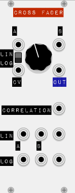

# submarine-prototype plugins for VCV
Prototype plugins for VCV Rack released under the SubmarinePrototype label

This is an independent effort neither endorsed nor directly affiliated with vcvrack

See https://vcvrack.com for more information about VCV rack

## Licence
This prototype code is copyright © 2018 David O'Rourke.

Full release code will most likely be released under an open source license in the near future.

# Cross Fader
An equal power cross-fader with diagnostic outputs

The cross fader takes two input signals A and B and the knob sweeps the output from 100% A through a mix of the two 
to 100% B.  The CV input can be used instead of the knob and takes a -5/+5V bipolar signal.
The module has two gain models for the fade. A linear model which offers 50% of each signal at the halfway point. And a logarithmic
model which offers approximately 70% at the halfway point. The preferred choice of model is generally dependant on the correlation of the A and B signals. 

Although this module does not currently offer an automated selector, it does offer a correlation output which ranges from around -1 to +1V and represents a fast approximation of the correlation between the input signals. For highly correlated signals (+1V) a linear model is generally preferred. Where the signals are significantly different and the correlation is low (0V) a logarithmic model will prevent the dip in perceived volume that might otherwise result. Highly negative correlation would result in destructive interference between the two signals, which can be mitigated by inverting either A or B.

The other diagnostic outputs offer the separated and combined gain signals for A, B and the two signals mixed - for both gain models.
